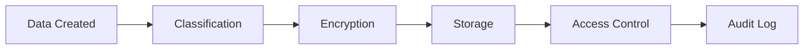
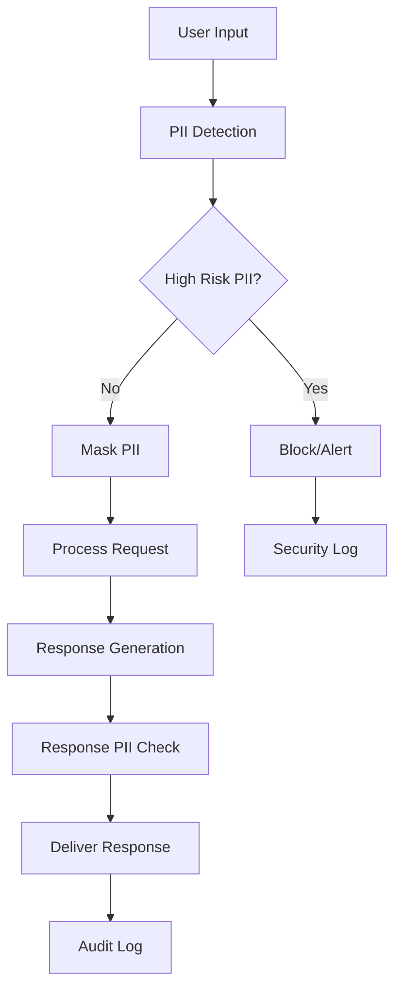

# Data Lifecycle & Access Control Policy

## Overview

This document defines the complete data lifecycle management and access control policies for Echoloom. It covers data classification, storage lifecycle, encryption requirements, access controls, and compliance obligations.

## Data Classification

### Classification Levels

#### Public Data
- **Definition**: Information that can be freely shared without risk
- **Examples**: Public documentation, marketing materials, API specifications
- **Protection**: Basic integrity protection
- **Retention**: No specific retention requirements

#### Internal Data
- **Definition**: Information for internal use that shouldn't be public
- **Examples**: Internal procedures, configuration templates, non-sensitive logs
- **Protection**: Access controls, basic encryption
- **Retention**: 3 years unless business need requires longer

#### Confidential Data
- **Definition**: Sensitive business information requiring protection
- **Examples**: User analytics, business metrics, system configurations
- **Protection**: Strong encryption, access controls, audit logging
- **Retention**: 2 years with secure deletion

#### Restricted Data
- **Definition**: Highly sensitive data requiring maximum protection
- **Examples**: PII, authentication data, financial information, health data
- **Protection**: Advanced encryption, strict access controls, comprehensive audit trails
- **Retention**: Minimum required by law/business need, maximum 90 days for conversations

## Data Storage Lifecycle

### Data Creation and Ingestion



**Process**:
1. **Automatic Classification**: Data automatically classified based on content and context
2. **Immediate Encryption**: All confidential/restricted data encrypted before storage
3. **Secure Storage**: Data stored in encrypted, access-controlled storage systems
4. **Access Logging**: All data access attempts logged with user, time, and purpose

### Storage Locations and Encryption

#### Conversation Data
- **Location**: Encrypted local storage or secure cloud storage
- **Encryption**: AES-256 with user-specific keys
- **Access**: Restricted to authorized personnel only
- **Backup**: Encrypted backups with separate key management

```python
# Example: Storing conversation data
from echoloom.data.encryption import store_encrypted

conversation_data = {
    "user_id": "user123",
    "timestamp": "2024-12-19T10:30:00Z",
    "message": "[MASKED_PII]",  # PII already masked
    "response": "How can I help you today?",
    "intent": "greeting",
    "pii_detected": ["email"]
}

# Automatically encrypted and stored
store_encrypted(
    key=f"conversation_{timestamp}",
    data=conversation_data,
    category=f"user_{user_id}"
)
```

#### Knowledge Base Data
- **Location**: Version-controlled encrypted storage
- **Encryption**: AES-256 for sensitive entries
- **Access**: Read access for application, write access for administrators
- **Versioning**: All changes tracked with audit trails

#### System Logs
- **Location**: Centralized logging system with encryption
- **Encryption**: AES-256 with log-specific keys
- **Access**: Security team and authorized administrators
- **Retention**: 2 years for security logs, 90 days for application logs

### Data Processing and Usage

#### Processing Principles
- **Purpose Limitation**: Data only used for declared purposes
- **Data Minimization**: Only necessary data collected and processed
- **Accuracy**: Regular data validation and correction procedures
- **Storage Limitation**: Data deleted when no longer needed

#### PII Processing Workflow



### Data Retention and Deletion

#### Retention Schedules

| Data Type | Retention Period | Deletion Method |
|-----------|------------------|-----------------|
| Conversation Data | 90 days | Secure overwrite |
| User Preferences | Until account deletion | Secure overwrite |
| Security Logs | 2 years | Secure overwrite |
| Audit Logs | 7 years | Secure overwrite |
| System Logs | 90 days | Standard deletion |
| Backup Data | Same as original + 30 days | Secure overwrite |

#### Automated Deletion Process

```python
# Automated data lifecycle management
from echoloom.data.lifecycle import DataLifecycleManager

lifecycle_manager = DataLifecycleManager()

# Daily cleanup process
def daily_cleanup():
    # Delete expired conversation data
    lifecycle_manager.cleanup_expired_data(
        category="conversations",
        max_age_days=90
    )
    
    # Archive old security logs
    lifecycle_manager.archive_data(
        category="security_logs",
        max_age_days=365
    )
    
    # Secure delete backup data beyond retention
    lifecycle_manager.secure_delete_expired(
        category="backups",
        max_age_days=120
    )
```

## Access Control Framework

### Role-Based Access Control (RBAC)

#### Defined Roles

**Public User**:
- Access: Chat API endpoints only
- Permissions: Send messages, receive responses
- Data Access: Own conversation data only (masked)
- Authentication: API key required

**Internal User**:
- Access: Chat API + metrics endpoints
- Permissions: View aggregated analytics, system health
- Data Access: Anonymized usage statistics
- Authentication: Internal API key + IP restrictions

**Administrator**:
- Access: All endpoints including admin functions
- Permissions: User management, system configuration, data export
- Data Access: All data except raw PII (masked view)
- Authentication: Strong API key + MFA

**Security Officer**:
- Access: Security endpoints, audit logs, encryption management
- Permissions: Security monitoring, incident response, key rotation
- Data Access: All security logs, encrypted data metadata
- Authentication: Strong API key + MFA + IP restrictions

**System Service**:
- Access: Internal service endpoints
- Permissions: Data processing, automated cleanup
- Data Access: Encrypted data for processing only
- Authentication: Service account with certificate-based auth

### Access Control Implementation

```python
# Role-based access control example
from echoloom.security import require_role, get_user_role

@app.get("/admin/users")
@require_role(["administrator", "security_officer"])
async def list_users(current_user: User = Depends(get_current_user)):
    # Only administrators and security officers can access
    return await get_user_list(mask_pii=True)

@app.post("/security/rotate-keys")
@require_role(["security_officer"])
async def rotate_keys(current_user: User = Depends(get_current_user)):
    # Only security officers can rotate keys
    return await perform_key_rotation()
```

### Data Access Patterns

#### Principle of Least Privilege
- Users granted minimum access required for their function
- Regular access reviews and permission audits
- Automatic permission expiration for temporary access
- Just-in-time access for sensitive operations

#### Access Logging and Monitoring

```python
# Comprehensive access logging
from echoloom.security import log_data_access

def access_user_data(user_id: str, accessor: str, purpose: str):
    # Log data access attempt
    log_data_access(
        data_type="user_conversation",
        data_id=user_id,
        accessor=accessor,
        purpose=purpose,
        access_granted=True,
        pii_accessed=False  # PII is always masked
    )
    
    # Retrieve encrypted data
    return retrieve_encrypted(user_id, category="users")
```

## Encryption Standards

### Encryption at Rest

#### Algorithm Requirements
- **Symmetric Encryption**: AES-256-GCM or AES-256-CBC with HMAC
- **Key Derivation**: PBKDF2 with SHA-256, minimum 100,000 iterations
- **Key Size**: 256-bit keys minimum
- **Initialization Vectors**: Cryptographically random, unique per encryption

#### Key Management

**Master Key**:
- Generated using cryptographically secure random number generator
- Stored in secure key management system (HSM preferred)
- Never stored in plaintext on disk
- Automatic rotation every 90 days

**Derived Keys**:
- Per-user and per-data-type key derivation
- Unique salt for each key derivation
- Keys cached in memory only during active use
- Automatic cleanup of unused keys

```python
# Key management example
from echoloom.data.encryption import KeyManager

key_manager = KeyManager()

# Get encryption key for specific user data
user_key = key_manager.get_encryption_key(f"user_{user_id}")

# Rotate all keys (scheduled operation)
key_manager.rotate_keys()

# Clean up old backup keys
key_manager.cleanup_old_keys()
```

### Encryption in Transit

#### TLS Requirements
- **Minimum Version**: TLS 1.3
- **Cipher Suites**: AEAD ciphers only (AES-GCM, ChaCha20-Poly1305)
- **Certificate Validation**: Strict certificate validation required
- **HSTS**: HTTP Strict Transport Security enabled

#### API Communication Security
- All API endpoints require HTTPS
- Certificate pinning for service-to-service communication
- Mutual TLS for internal service authentication
- API keys transmitted only over encrypted connections

## Data Backup and Recovery

### Backup Strategy

#### Backup Types
- **Full Backup**: Complete system backup weekly
- **Incremental Backup**: Daily incremental backups
- **Continuous Backup**: Real-time replication for critical data
- **Point-in-Time Recovery**: 24-hour recovery point objective

#### Backup Encryption
- All backups encrypted with separate encryption keys
- Backup keys stored in separate key management system
- Regular backup integrity verification
- Secure backup transport and storage

```python
# Backup encryption example
from echoloom.data.backup import BackupManager

backup_manager = BackupManager()

# Create encrypted backup
backup_manager.create_backup(
    source_data="user_conversations",
    encryption_key_id="backup_key_2024",
    destination="secure_backup_storage"
)

# Verify backup integrity
backup_manager.verify_backup_integrity("backup_20241219")
```

### Disaster Recovery

#### Recovery Procedures
1. **Immediate Response**: Isolate affected systems
2. **Assessment**: Evaluate data integrity and availability
3. **Recovery**: Restore from most recent clean backup
4. **Verification**: Validate data integrity and system functionality
5. **Documentation**: Record incident and recovery actions

#### Recovery Time Objectives
- **Critical Systems**: 4 hours maximum downtime
- **User Data**: 24 hours maximum data loss
- **System Configuration**: 2 hours maximum recovery time
- **Security Systems**: 1 hour maximum recovery time

## Compliance and Audit

### Regulatory Compliance

#### GDPR Requirements
- **Data Subject Access**: Automated data export functionality
- **Right to Rectification**: Data correction procedures
- **Right to Erasure**: Secure deletion with verification
- **Data Portability**: Encrypted data export in standard formats
- **Breach Notification**: 72-hour notification procedures

#### CCPA Compliance
- **Consumer Rights**: Access, deletion, and opt-out procedures
- **Data Minimization**: Only necessary data collection
- **Third-Party Disclosure**: No personal data sharing without consent
- **Security Safeguards**: Reasonable security measures implemented

### Audit Requirements

#### Internal Audits
- **Monthly**: Access control reviews
- **Quarterly**: Data retention compliance
- **Annually**: Full security and privacy audit
- **Ad-hoc**: Incident-triggered audits

#### External Audits
- **Annual**: Third-party security assessment
- **Bi-annual**: Compliance audit by certified auditors
- **Continuous**: Automated compliance monitoring

#### Audit Trail Requirements

```python
# Comprehensive audit logging
from echoloom.audit import AuditLogger

audit_logger = AuditLogger()

# Log data lifecycle events
audit_logger.log_event(
    event_type="data_created",
    user_id="system",
    data_type="conversation",
    data_id="conv_123",
    details={
        "classification": "restricted",
        "encryption_applied": True,
        "retention_period": "90_days"
    }
)

# Log access events
audit_logger.log_access(
    accessor="admin_user",
    data_type="user_data",
    data_id="user_456",
    action="read",
    purpose="support_request",
    pii_accessed=False
)
```

## Data Subject Rights

### Right to Access

**Process**:
1. User submits access request with identity verification
2. System generates encrypted export of user data
3. PII is masked in export for security
4. Export delivered via secure channel
5. Access logged for audit purposes

### Right to Rectification

**Process**:
1. User requests data correction with evidence
2. Administrator reviews and validates request
3. Data updated with audit trail
4. User notified of changes
5. All related systems updated

### Right to Erasure

**Process**:
1. User requests data deletion
2. System identifies all user data across categories
3. Secure deletion performed with overwrite
4. Deletion verified and logged
5. User provided with deletion certificate

```python
# Data subject rights implementation
from echoloom.privacy import DataSubjectRights

privacy_handler = DataSubjectRights()

# Handle access request
def handle_access_request(user_id: str, verification_token: str):
    if privacy_handler.verify_identity(user_id, verification_token):
        # Generate masked data export
        user_data = privacy_handler.export_user_data(
            user_id=user_id,
            mask_pii=True,
            include_audit_trail=False
        )
        return privacy_handler.create_secure_export(user_data)

# Handle deletion request
def handle_deletion_request(user_id: str, verification_token: str):
    if privacy_handler.verify_identity(user_id, verification_token):
        # Perform secure deletion
        deletion_result = privacy_handler.delete_user_data(
            user_id=user_id,
            secure_overwrite=True,
            verify_deletion=True
        )
        return privacy_handler.generate_deletion_certificate(deletion_result)
```

## Monitoring and Alerting

### Data Lifecycle Monitoring

**Metrics Tracked**:
- Data creation and classification rates
- Encryption success/failure rates
- Data retention compliance
- Deletion completion rates
- Backup success rates
- Access pattern anomalies

**Automated Alerts**:
- Failed encryption operations
- Retention policy violations
- Unauthorized access attempts
- Backup failures
- Key rotation failures
- Compliance violations

### Security Monitoring

```python
# Security monitoring for data lifecycle
from echoloom.monitoring import DataLifecycleMonitor

monitor = DataLifecycleMonitor()

# Monitor data access patterns
monitor.track_access_patterns(
    alert_on_anomalies=True,
    baseline_period_days=30,
    anomaly_threshold=2.0  # Standard deviations
)

# Monitor encryption health
monitor.check_encryption_status(
    alert_on_failures=True,
    check_interval_minutes=5
)

# Monitor compliance status
monitor.verify_compliance(
    policies=["gdpr", "ccpa"],
    alert_on_violations=True
)
```

---

**Document Version**: 1.0  
**Last Updated**: 2024-12-19  
**Next Review**: 2025-03-19  
**Owner**: Security Team  
**Approved By**: Chief Security Officer  

This document must be reviewed and updated quarterly or when significant changes are made to data handling procedures.