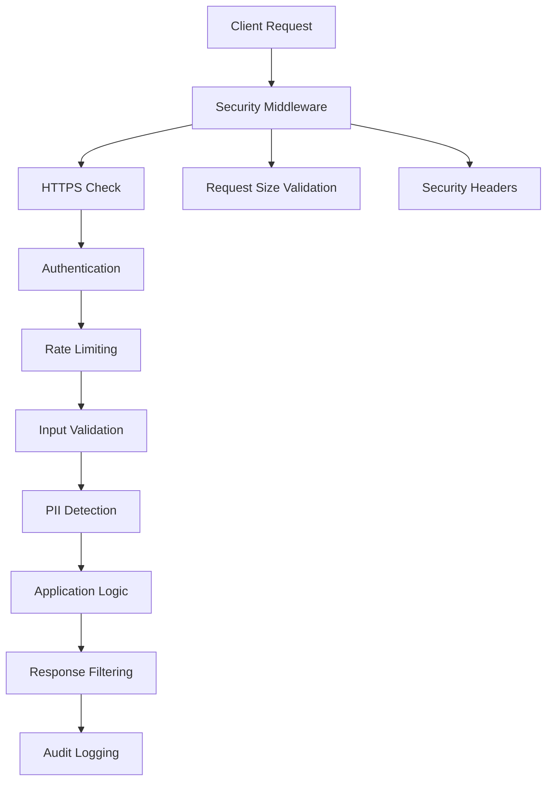

# Echoloom Security Documentation

## Overview

This document outlines the comprehensive security architecture and implementation for the Echoloom AI chatbot backend. Our security approach follows industry best practices and compliance requirements for handling sensitive data and AI-powered services.

## Security Architecture

### Defense in Depth

Echoloom implements a multi-layered security approach:

1. **Network Security**: HTTPS enforcement, security headers
2. **Application Security**: Input validation, authentication, authorization
3. **Data Security**: Encryption at rest and in transit, PII protection
4. **Infrastructure Security**: Container security, secure configuration
5. **Monitoring & Logging**: Security event logging, audit trails

### Security Components



## Authentication & Authorization

### API Key Management

**Strong Key Generation**:
```python
from echoloom.security import generate_secure_api_key

# Generate cryptographically secure API key
api_key = generate_secure_api_key()  # 32+ character URL-safe base64
```

**Key Storage**:
- Production keys stored in environment variables or secret management systems
- Development keys clearly marked and never used in production
- Key rotation supported every 90 days (configurable)

**Key Validation**:
- Minimum 16 character length requirement
- Detection and rejection of weak/common keys
- Secure hashing with PBKDF2 and salt for storage

### Security Headers

All responses include comprehensive security headers:

```http
X-Content-Type-Options: nosniff
X-Frame-Options: DENY
X-XSS-Protection: 1; mode=block
Content-Security-Policy: default-src 'self'; script-src 'self'; ...
Strict-Transport-Security: max-age=31536000; includeSubDomains; preload
Referrer-Policy: strict-origin-when-cross-origin
Permissions-Policy: camera=(), microphone=(), geolocation=(), ...
```

## Input Validation & Sanitization

### Comprehensive Input Validation

**Message Validation**:
- Maximum length: 10,000 characters
- Non-empty string requirement
- HTML sanitization (strips all tags)
- Suspicious pattern detection and blocking

**Blocked Patterns**:
- Script tags and JavaScript execution
- SQL injection attempts
- XSS vectors
- System command injection
- Document/window object access

**Example**:
```python
from echoloom.security import InputValidator

validator = InputValidator()
clean_message = validator.validate_message(user_input)
```

### Request Size Limits

- Maximum request size: 1MB
- Prevents DoS attacks via large payloads
- Automatic rejection with HTTP 413 status

## PII Detection & Protection

### Advanced PII Detection

**Detected PII Types**:
- Email addresses
- Phone numbers (various formats)
- Social Security Numbers
- Credit card numbers
- IP addresses
- URLs
- Passport numbers
- Driver's license numbers
- Bank account numbers
- Dates of birth
- Physical addresses
- Personal names

**Detection Confidence Scoring**:
- High confidence (>0.9): Email, SSN, Credit Cards
- Medium confidence (0.5-0.9): Phone, IP addresses
- Lower confidence patterns filtered to reduce false positives

### PII Masking Strategies

**Email Masking**:
```
john.doe@example.com → j*******@example.com
```

**SSN Masking**:
```
123-45-6789 → ***-**-****
```

**Credit Card Masking**:
```
4532-1234-5678-9012 → ****-****-****-9012
```

**High-Risk PII**:
- SSN, Credit Cards, Bank Accounts completely removed
- Never stored in logs or responses
- Immediate security alerts generated

### Pseudonymization

For user tracking while preserving privacy:
```python
from echoloom.nlp.pii import pseudonymize_pii

# Consistent pseudonyms for same user
pseudonymized = pseudonymize_pii(message, user_id="user123")
# "My email is john@example.com" → "My email is [EMAIL_a1b2c3d4]"
```

## Data Encryption

### Encryption at Rest

**Key Management**:
- Master key generation with Fernet (AES-128-CBC)
- Key derivation using PBKDF2 with 100,000 iterations
- Automatic key rotation every 90 days
- Secure key backup with retention policy

**Data Encryption**:
```python
from echoloom.data.encryption import encrypt_sensitive_data

# Encrypt sensitive data
encrypted = encrypt_sensitive_data(sensitive_data, key_id="user_data")

# Decrypt when needed
decrypted = decrypt_sensitive_data(encrypted)
```

**File Encryption**:
- Automatic encryption for sensitive files
- Metadata preservation with encryption details
- Secure file deletion with data overwriting

### Encryption in Transit

**HTTPS Enforcement**:
- TLS 1.3 required for production
- HTTP requests automatically rejected (except localhost)
- HSTS headers for browser security

**API Communication**:
- All API endpoints require HTTPS
- Certificate validation enforced
- Secure cipher suites only

### Secure Storage

**Encrypted Storage Interface**:
```python
from echoloom.data.encryption import store_encrypted, retrieve_encrypted

# Store sensitive data with automatic encryption
store_encrypted("user_preferences", user_data, category="user_123")

# Retrieve and automatically decrypt
user_data = retrieve_encrypted("user_preferences", category="user_123")
```

**Storage Features**:
- Category-based organization
- Automatic encryption/decryption
- Secure deletion with data overwriting
- Access logging and audit trails

## Security Monitoring & Logging

### Security Event Logging

**Monitored Events**:
- Authentication failures
- Suspicious input patterns
- High-risk PII detection
- Rate limit violations
- Data access and modifications
- Administrative actions

**Log Format**:
```json
{
  "timestamp": 1640995200.0,
  "event_type": "high_risk_pii_detected",
  "client_ip": "192.168.1.100",
  "user_agent": "Mozilla/5.0...",
  "endpoint": "/chat",
  "details": {
    "pii_types": ["ssn", "credit_card"],
    "confidence_scores": [0.95, 0.89]
  }
}
```

### Metrics & Monitoring

**Security Metrics**:
- Authentication success/failure rates
- PII detection counts by type
- Security event frequencies
- Rate limiting effectiveness
- Encryption key rotation status

**Prometheus Metrics**:
```
security_events_total{event_type="high_risk_pii"} 5
pii_detected_total{pii_type="email"} 142
rate_limit_violations_total 23
```

## Compliance & Privacy

### GDPR Compliance

**Data Subject Rights**:
- Right to access: User data retrieval via secure APIs
- Right to rectification: Data update mechanisms
- Right to erasure: Secure data deletion with audit trails
- Right to portability: Encrypted data export functionality

**Data Processing**:
- Lawful basis documentation
- Data minimization principles
- Purpose limitation enforcement
- Storage limitation with automatic deletion

**Consent Management**:
- Explicit consent tracking
- Withdrawal mechanisms
- Granular permission controls
- Audit trail maintenance

### Data Retention Policies

**Conversation Data**:
- Encrypted storage with user pseudonyms
- Automatic deletion after 90 days (configurable)
- Secure overwrite on deletion
- Audit logs retained for compliance (7 years)

**Security Logs**:
- Retention period: 2 years
- Encrypted storage
- Access restricted to security team
- Regular archive and purge processes

## Security Configuration

### Environment Configuration

**Production Settings**:
```bash
# Security Configuration
SECURITY_REQUIRE_HTTPS=true
SECURITY_ENABLE_HEADERS=true
SECURITY_LOG_EVENTS=true
SECURITY_BLOCK_SUSPICIOUS_PATTERNS=true
SECURITY_ENABLE_INPUT_SANITIZATION=true

# Encryption Configuration
ENCRYPTION_ENABLED=true
KEY_ROTATION_DAYS=90
BACKUP_KEYS_COUNT=3

# Rate Limiting
RATE_LIMIT_PER_MINUTE=60
```

**Development Settings**:
```bash
# Relaxed settings for development
SECURITY_REQUIRE_HTTPS=false
SECURITY_LOG_EVENTS=false
```

### Security Hardening Checklist

**Application Level**:
- [ ] Strong API keys generated and rotated
- [ ] Input validation enabled for all endpoints
- [ ] PII detection active with high-risk blocking
- [ ] Security headers configured
- [ ] Rate limiting properly configured
- [ ] Error messages sanitized

**Infrastructure Level**:
- [ ] HTTPS enforced with valid certificates
- [ ] Container running as non-root user
- [ ] Secrets stored in secure management system
- [ ] Network policies restricting access
- [ ] Regular security updates applied

**Data Level**:
- [ ] Encryption at rest enabled
- [ ] Key management system configured
- [ ] Secure deletion procedures implemented
- [ ] Backup encryption verified
- [ ] Access logging enabled

## Security Testing

### Automated Security Testing

**Static Analysis (SAST)**:
```bash
# Run security linting
bandit -r src/

# Check for known vulnerabilities
safety check

# Dependency scanning
pip-audit
```

**Dynamic Testing (DAST)**:
```bash
# API security testing
pytest tests/test_security.py -v

# Load testing with security focus
locust -f security_load_test.py
```

### Manual Security Testing

**Penetration Testing Checklist**:
- [ ] Authentication bypass attempts
- [ ] Input validation testing
- [ ] SQL injection testing
- [ ] XSS vulnerability testing
- [ ] CSRF protection validation
- [ ] Rate limiting effectiveness
- [ ] PII leakage testing
- [ ] Encryption strength validation

## Incident Response

### Security Incident Classification

**Critical (P0)**:
- Data breach or unauthorized access
- Authentication system compromise
- Encryption key exposure

**High (P1)**:
- PII exposure in logs or responses
- Successful injection attacks
- Rate limiting bypass

**Medium (P2)**:
- Suspicious activity patterns
- Failed authentication attempts
- Configuration security issues

### Response Procedures

**Immediate Actions**:
1. Isolate affected systems
2. Preserve evidence and logs
3. Notify security team and stakeholders
4. Implement temporary mitigations

**Investigation**:
1. Analyze security logs and metrics
2. Determine scope and impact
3. Identify root cause
4. Document findings

**Recovery**:
1. Apply permanent fixes
2. Rotate compromised credentials
3. Update security measures
4. Conduct post-incident review

## Security Contacts

**Security Team**: security@echoloom.com  
**Incident Reporting**: incidents@echoloom.com  
**Vulnerability Disclosure**: security-reports@echoloom.com  

## Regular Security Tasks

### Daily
- [ ] Monitor security alerts and logs
- [ ] Review failed authentication attempts
- [ ] Check for unusual PII detection patterns

### Weekly
- [ ] Review security metrics and trends
- [ ] Update security documentation
- [ ] Conduct security configuration reviews

### Monthly
- [ ] Security vulnerability assessments
- [ ] Access permission reviews
- [ ] Security training updates

### Quarterly
- [ ] Penetration testing
- [ ] Security architecture reviews
- [ ] Compliance audit preparations
- [ ] Key rotation procedures

---

**Document Version**: 1.0  
**Last Updated**: 2024-12-19  
**Next Review**: 2025-03-19  

For technical implementation details, see the security module source code and test suites.