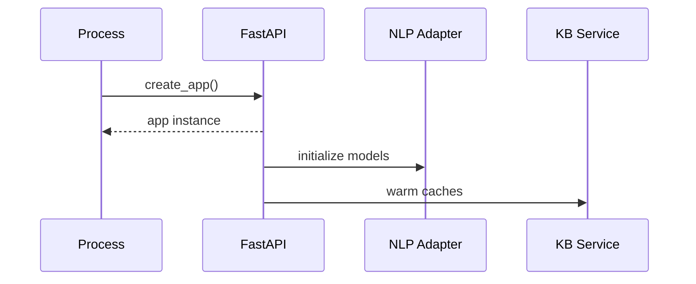
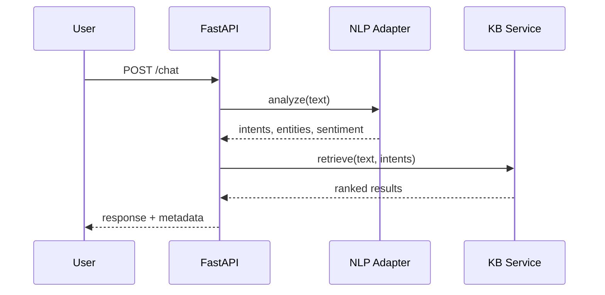

# Core Flows

## Startup

```mermaid
sequenceDiagram
  participant Proc as Process
  participant App as FastAPI
  participant Adapter as NLP Adapter
  participant KB as KB Service
  Proc->>App: create_app()
  App-->>Proc: app instance
  App->>Adapter: initialize models
  App->>KB: warm caches
```

## Chat Inference

```mermaid
sequenceDiagram
  participant U as User
  participant API as FastAPI
  participant N as NLP Adapter
  participant KB as KB Service
  U->>API: POST /chat
  API->>N: analyze(text)
  N-->>API: intents, entities, sentiment
  API->>KB: retrieve(text, intents)
  KB-->>API: ranked results
  API-->>U: response + metadata
```