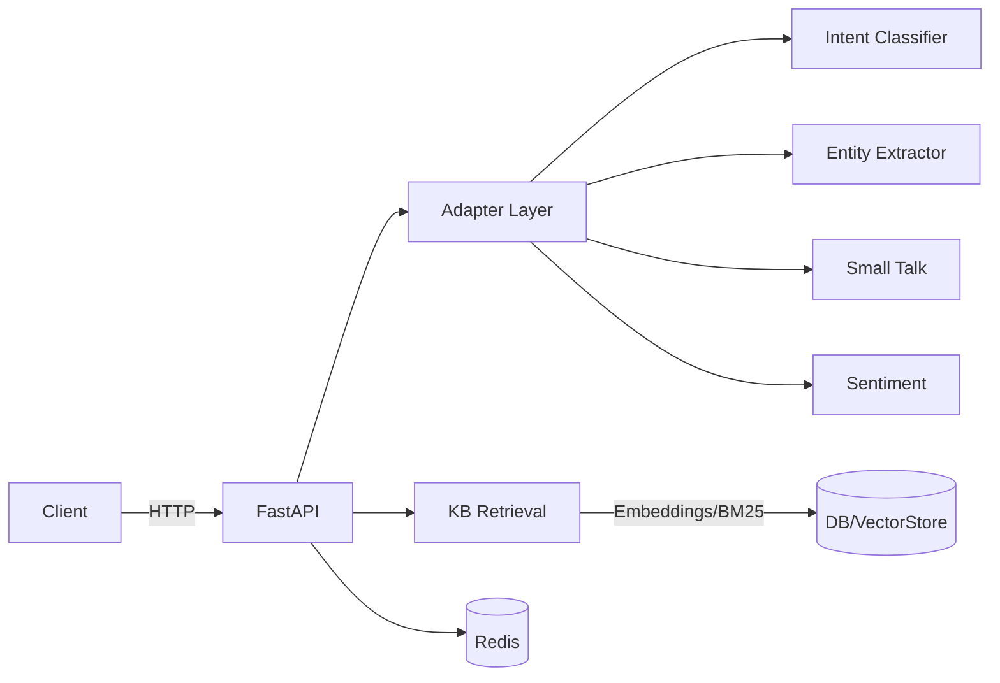
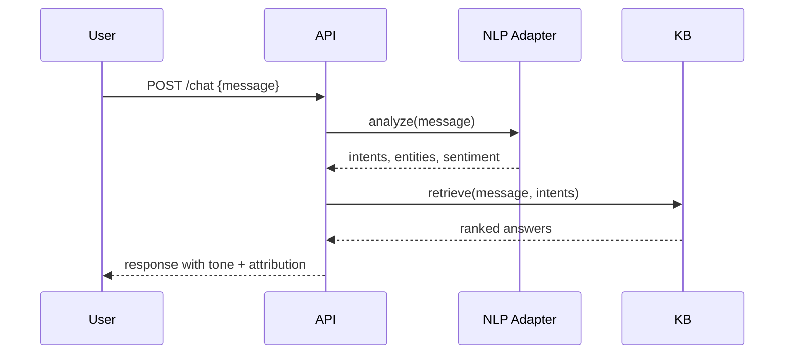

# Echoloom Architecture

## Components

- API Service (FastAPI): handles REST endpoints and routing
- NLP Engine: intent recognition, NER, small talk (pluggable adapters)
- KB Service: FAQ storage, retrieval, ranking
- Sentiment: detection and tone adjustment
- Data Stores: Postgres/Mongo for structured data; optional vector store
- Cache & RL: Redis for caching and rate-limiting

## High-level Diagram (Mermaid)

## Sequence: Chat Request

## Component Responsibilities

- API: auth, rate-limits, validation, orchestration
- NLP Adapter: unified interface for models and rules
- KB: ingestion, retrieval, ranking, confidence thresholds
- Sentiment: classification and tone rules
- Observability: structured logs, metrics, healthchecks